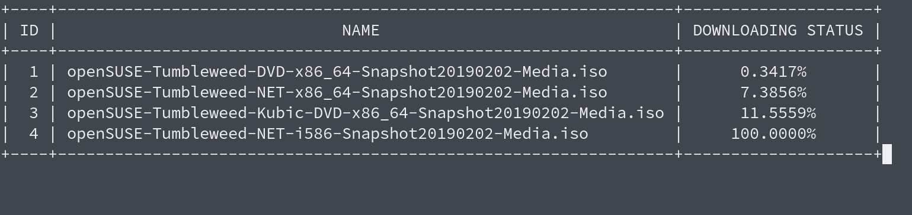

# Simple Downloader
A simple downloader written in go.

## Preview



## Usage
### Download

Use command:
```bash
$ go get -u github.com/iochen/GoSimpleProjects/tree/master/SimpleDownloader
```
(or download from [releases](https://github.com/iochen/SimpleDownloader/releases))

### Opinions
```bash
Usage of simpledownloader:
  -f string
        File(s) that stores the URL.
  -u string
        Url(s) that you want to download.
```
### Examples
 ```bash
 $ simpledownloader -f "[filename 1] [filename 2]..." -u "[url 1] [url 2]..."
 ```

 ## LICENSE
 MIT LICENSE
